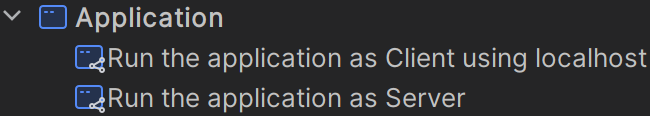
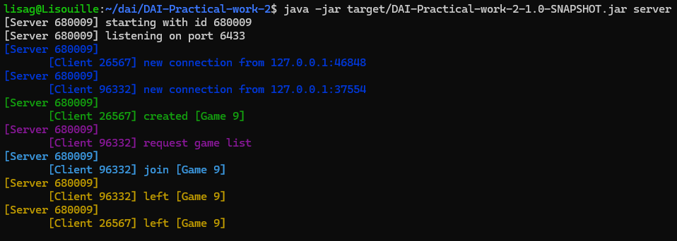
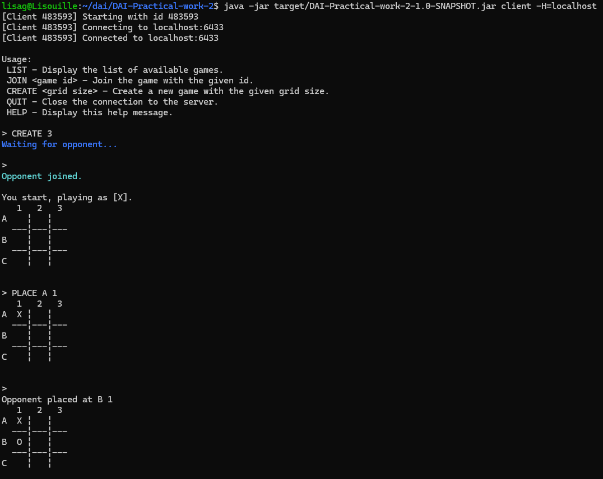
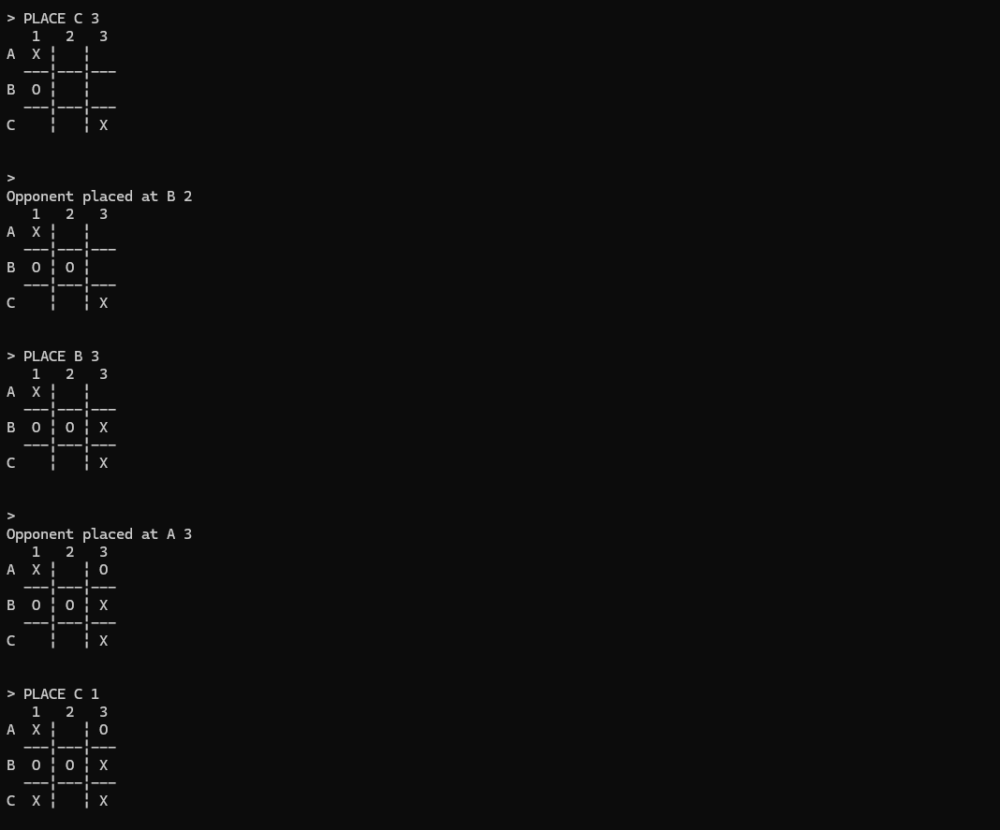
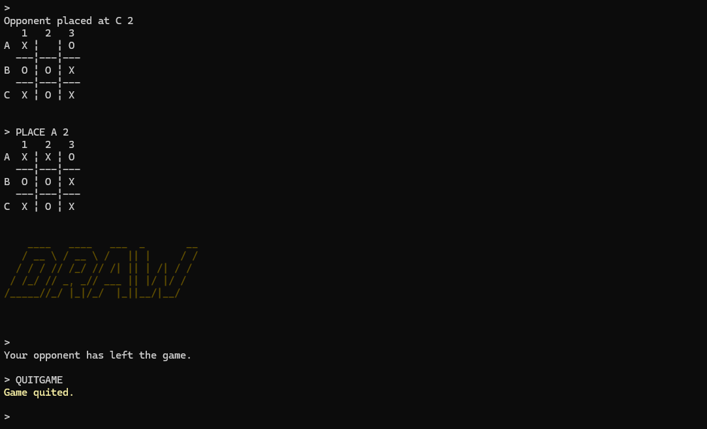
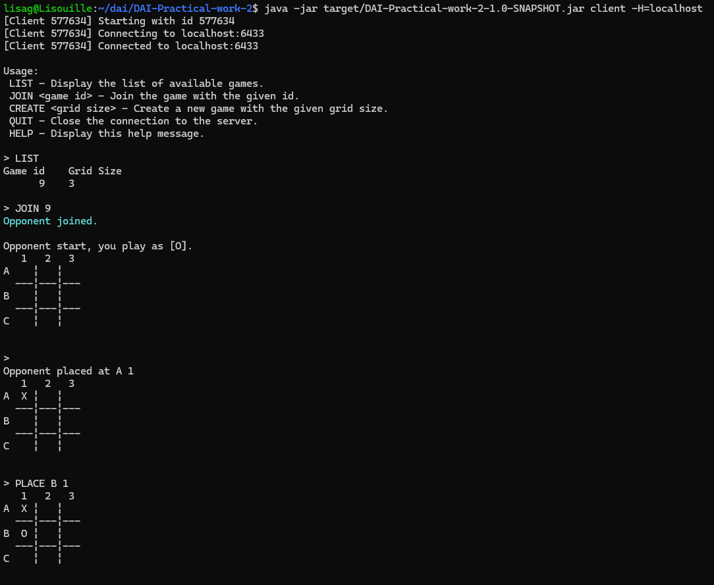
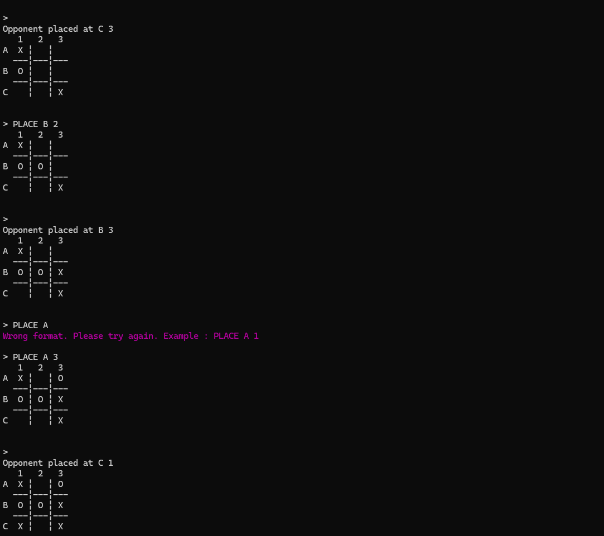
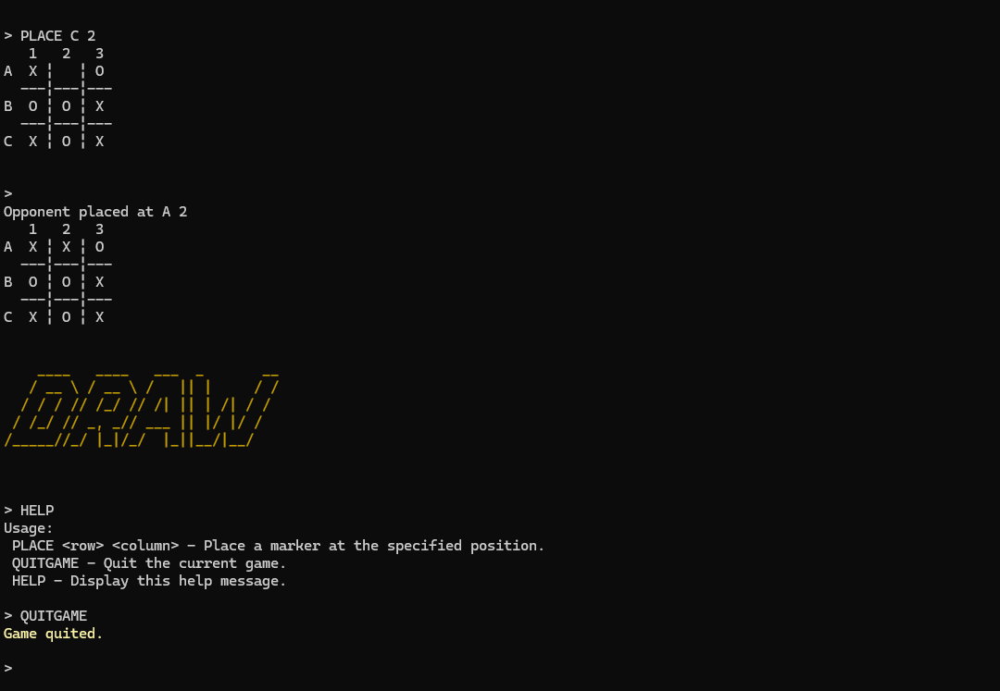

# Practical work 2
## Author 
- Alex Berberat
- Lisa Gorgerat

## Table of content
- [Introduction](#introduction)
- [Getting Started Using GitHub](#getting-started-using-github)
  - [Prerequisites](#prerequisites)
  - [Recommendation](#recommendation)
  - [Setup](#setup)
    - [Clone the repository](#clone-the-repository)
    - [Build the application](#build-the-application)
- [Getting Started Using Docker](#getting-started-using-docker)
  - [Prerequisites](#prerequisites-1)
  - [Recommendation](#recommendation-1)
  - [Setup](#setup-1)
    - [Get the package](#get-the-package)
    - [Build the application](#build-the-application-1)
- [Usage](#usage)
  - [Run the application](#run-the-application)
    - [Using Docker](#using-docker)
    - [Without Docker](#without-docker)
- [Demonstration](#demonstration)
  - [On localhost without docker](#on-localhost-without-docker)
  - [With 3 docker containers](#with-3-docker-containers)

## Introduction
This practical work running in java 21 is a picocli based CLI that use the TCP protocol to play a game of tic-tac-toe.
 
A player can connect to a server and choose the size of the board for this game.
Another player can connect to the same server to play with the first one.

With each move, the new situation is printed in the terminal.

A new game can be started without closing and reopening a server connection.

## Getting Started Using GitHub
### Prerequisites
- JDK
- Maven (optional, a maven wrapper comes with the project)
- Docker (if you want to run an image)

### Recommendation
Use Intellij IDEA because the whole project was built using it.

### Setup
#### Clone the repository
1. Go to the [repository](https://github.com/AlexB-HEIG/DAI-Practical-work-2) on GitHub and choose your favorite clone option.
2. Open the terminal in the folder where you want to clone the repository.
3. Clone the repo.
    ```sh 
    git clone https://github.com/AlexB-HEIG/DAI-Practical-work-2.git
    ```
4. Change git remote url to avoid accidental pushes to base project.
    ```sh
    git remote set-url origin <github_username/repo_name>
    git remote -v
    ```

#### Build the application
To build the application, you can use the following commands in your terminal.
```sh
# Download the dependencies and their transitive dependencies
./mvnw dependency:go-offline

# Package the application
./mvnw package
```
Or you can use _Package application as JAR file_ configuration file to build easily in Intellij IDEA.  


## Getting Started Using Docker
### Prerequisites
To use the docker image of our game, you first need to ensure that docker is installed on your machine.  
If that's not the case, please go to the official website ([Dockerdocs](https://docs.docker.com/engine/)) and follow the instruction for the version you need.

### Recommendation

### Setup
#### Get the package

Go get our package on [placeholder](https://github.com/LisaGorgerat?tab=packages)

#### Build the application
 
To build the image, go into the folder of the app and use the command:
```sh
docker build -t <app_name> .
```

## Usage
Once the app is built, you can run it.

### Run the application
#### Using Docker

In the case of docker, we also need to create a network, so that 2 containers can communicate with each other:
````sh
docker network create <network_name>
````

And you can list the Docker networks with:
````sh
docker network ls
````

Then you need to run each container:

- the first one:
````sh
docker run --rm -it --network <network_name> --name <container_name> <img_name> -l <port>
````

- the second one:
````sh
docker run --rm -it --network <network_name> --name <img_name> <container_name> <port>
````


#### Without Docker 
You can also run the app directly on your computer. For that you need to build the jar file and then use the following command in the terminal : 
````sh
java -jar target/DAI-Practical-work-2-1.0-SNAPSHOT.jar client -H <host> 
java -jar target/DAI-Practical-work-2-1.0-SNAPSHOT.jar server 
````
> [!NOTE] 
> Note that you will need to have multiple terminal opened at the same time to be able to initial all the needed instance of the program.


You can also use the premade configs:



> [!IMPORTANT]
> In order for the client to work you need to have an instance of the server running.


## Demonstration
### On localhost without docker
We begin by starting the server using : 
```sh
java -jar target/DAI-Practical-work-2-1.0-SNAPSHOT.jar server
```


> [!NOTE]
> The picture was taken at the end of the following gameplay demonstration.


We can then start the client using :
```sh
java -jar target/DAI-Practical-work-2-1.0-SNAPSHOT.jar client -H localhost
```

For the first client, we initiate it and create the game:




For the second client, we initiate it and we join the game:





### With 3 docker containers

We first create the network:


We initiate the server:


For the first client, we initiate it and create the game:


For the second client, we initiate it and we join the game:
