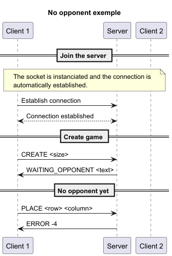
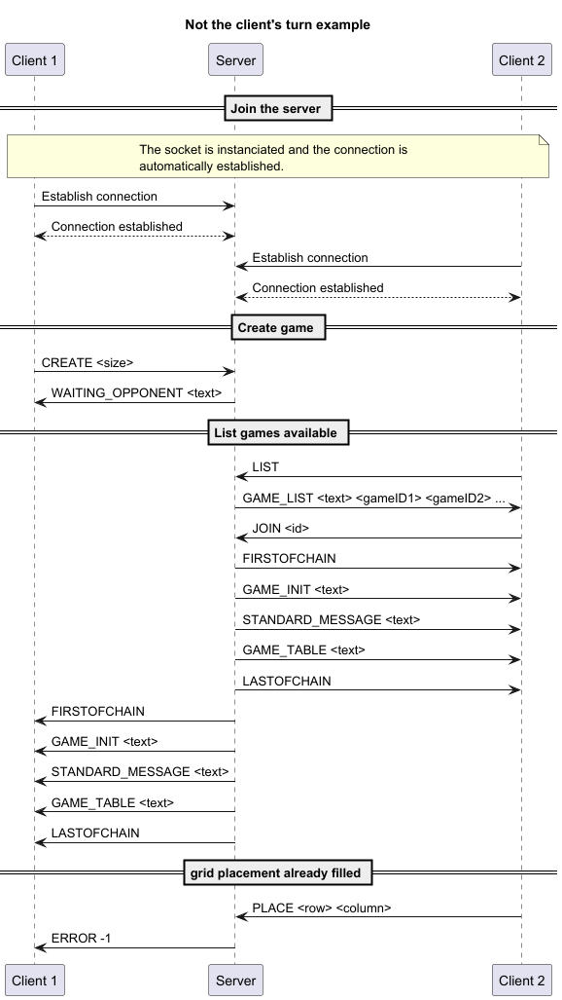

# Application protocol

## Table of content
   -[Section 1 - Overview](#section-1---overview)  
   -[Section 2 - Transport protocol](#section-2---transport-protocol)  
   -[Section 3 - Messages](#section-3---messages)  
   -[Section 4 - Examples](#section-4---examples)

## Section 1 - Overview

The "Tic Tac Toe" protocol is a communication protocol that allows clients to play tic tac toe on a server together.

## Section 2 - Transport protocol

The "Tic Tac Toe" protocol is a text transport protocol. It uses the TCP transport protocol to ensure the reliability of data transmission. The port it uses is the port number 6433.  

Every message must be encoded in UTF-8. The messages are treated as text messages.

The initial connection must be established by one of the clients, he is attributed Player 1.

Once the connection is estalibshed, the player 1 choose the size of the board(min 3 and max 9).
The board is generated.

Another client can connect to the same server and will be attributed Player 2.

A loop will initiate, where:
- A player will make a move 
- His board is updated
- The other player will be notified of the move
- The other player's board is updated

A move is communicated using X, the column, and Y, the line, with the format `XY`.

Another format will send back an error.

An error can also be sent, if a player tries to put his symbol in a space that is already occupied.

After a minimum number of moves depending on the size of the board, the appilcation will begin to check for a win.
If the number of moves maximum is reached, the game will be determined to be a draw.

After a game has finished, the Player 1 can choose to begin another game, where they can put the same size of board or change it, or exit.

> [!NOTE]  
> 
> The network connection can be closed on both sides (client and server). In the SMS protocol, the client closes the connection. In this example, we have decided that the client will advise the server to close the connection. The server will then close the connection on its side. This will close the connection on the client side as well.
> Both solutions are possible.


## Section 3 - Messages

### Create game

The client sends a create message to the server specifying the board size.

#### Request

````sh
CREATE <board size>
````

- ``board size``: the size of the board to create

#### Response

- ``WAIT_OPPONENT``: The board has been successfully created
- ``INVALID``: There was an error
  - 1: The board size wasn't specified
  - 2: The size wasn't 3, 5, 7 or 9

### List games

The client sends a list message to the server to see the list of games available.

#### Request

````sh
LIST
````

#### Response

- ``GAME_LIST``: The server list the games available

### Join game

The client sends a join message to the server specifying id of the game to join

#### Request

````sh
JOIN <id>
````

- ``id``: id of the game to join

#### Response

- ``FIRSTOFCHAIN``: Announce the beginning of game communication
- ``INIT_GAME``: Initialize the game
- ``STANDARD_MESSAGE``: Send the message giving the symbol and first turn
- ``GAME_TABLE``: Show the board
- ``LASTOFCHAIN``: Announce the end of game communication
- ``INVALID``: There was an error
    - 1: The id doesn't correspond to an existing game

### Commands help

The client sends a help message to the server to see tha commands and what they do.

#### Request

````sh
HELP
````

#### Response

- ``OK``: The commands are being listed

### Quit server

The client sends a quit message to the server stop the connection.

#### Request

````sh
QUIT
````

#### Response

- ``OK``: The client is disconnected from the server

### Messages scpecific to the game

NB: ``HELP`` can be used during games to list the commands of the the game.

#### Place symbol

The client sends a place message to the server specifying the placement in the grid

##### Request

````sh
PLACE <row> <column>
````

- ``row``: row of the grid chosen
- ``column``: column of the grid chosen

##### Response

- ``GAME_TABLE``: Show the board
- ``INVALID``: There was an error
    - -1: It's not the client's turn to play
    - -2: Grid placement out of bounds
    - -3: Grid placement is already filled
    - -4: There is no opponent
    - -5: The game has already ended
    - 1: Wrong command format

In case of victory, loss or draw:
- ``FIRSTOFCHAIN``: Announce the beginning of game communication
- ``STANDARD_MESSAGE``: Send the message giving the symbol and first turn
- ``GAME_TABLE``: Show the board
- ``ENDGAME_MESSAGE``: Send the message for the result
- ``LASTOFCHAIN``: Announce the end of game communication

#### Quit game

The client sends a quit message to the server stop the game.

##### Request

````sh
QUITGAME
````

##### Response

- ``CONFIRMQUITGAME``: Send the message that the client quit the game successfully
  - The client recieve a message that they have won the game by forfeit, if done before the end of the game

## Section 4 - Examples

### Functional Example

### Client try to create a board without specifying the size

### Client try to create a board with an invalid size

### A Player try to join a game that is already full

### A player try to play when there is no opponent

### A player try to play when it's not his turn

### Wrong Format grid selection error

### Case already filed error

### Out of bound grid selection error

### A client try to place something when the game has ended
