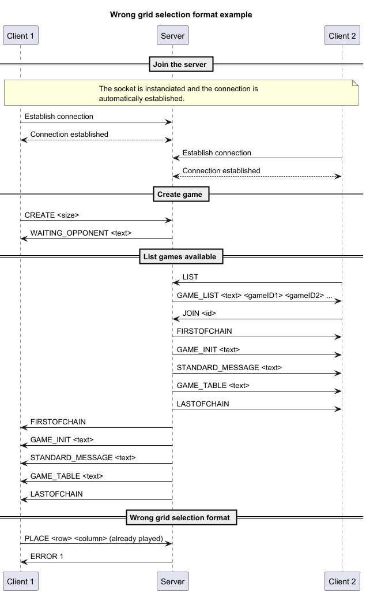
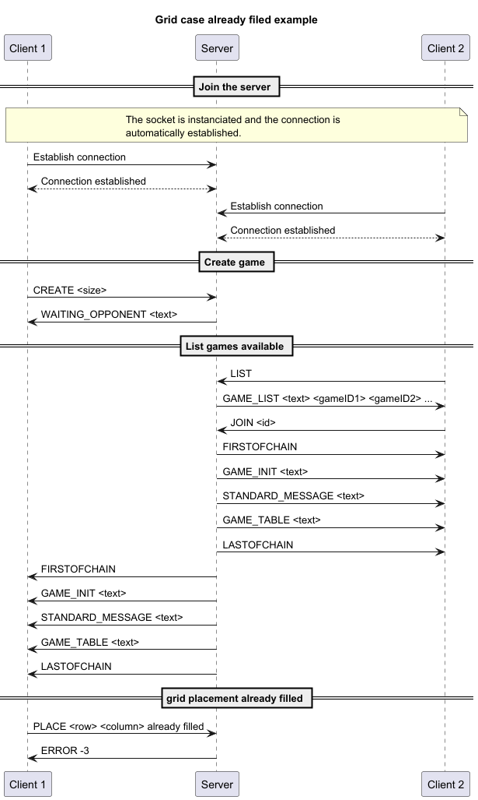
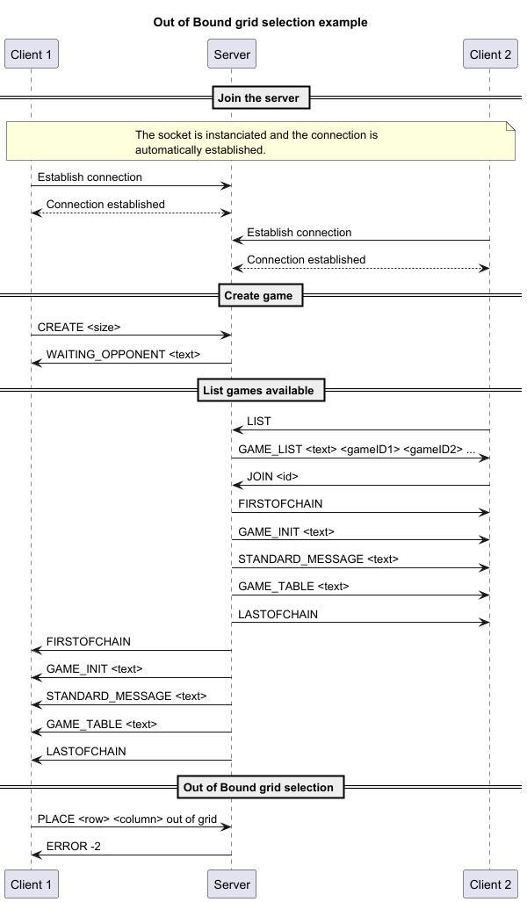

# Application protocol TicTacToe
## Table of content
- [Section 1 - Overview](#section-1---overview)  
- [Section 2 - Transport protocol](#section-2---transport-protocol)  
- [Section 3 - Messages](#section-3---messages)  
- [Section 4 - Examples](#section-4---examples)

## Section 1 - Overview

The "Tic Tac Toe" protocol is a communication protocol that allows clients to play tic-tac-toe on a server together.

## Section 2 - Transport protocol

The "Tic Tac Toe" protocol is a text transport protocol. It uses the TCP transport protocol to ensure the reliability of data transmission. The port it uses is the port number 6433.  

Every message must be encoded in UTF-8 and delimited by a newline character (`\n`). The messages are treated as text messages.

The initial connection must be established by the clients.

Once the connection is established, the client is attributed an ID.

Another client can connect to the same server and will be attributed another ID.

The client can send a message to the server indicating what to do.

For example,  choose the size of the board(min 3 and max 9).

The board is generated.

A loop will initiate, where:
- A player will make a move 
- His board is updated
- The other player will be notified of the move
- The other player's board is updated

A move is communicated using X, the column, and Y, the line, with the format `X Y`.

Another format will send back an error.

An error can also be sent, if a player tries to put his symbol in a space that is already occupied.

After each move, the application will check for a win.

If the maximum number of moves is reached, the game will be determined to be a draw.

After a game has finished, the Player 1 can choose to begin another game, where they can put the same size of board or change it, or exit.

> [!NOTE]  
> 
> The network connection can be closed on both sides (client and server).

## Section 3 - Messages

### Create game
The client sends a create message to the server specifying the board size.

#### Request
```sh
CREATE <board size>
```
- ``board size``: the size of the board to create.

#### Response
- ``WAIT_OPPONENT <text>``: The board has been successfully created.
- ``INVALID <text>``: There was an error. The error is a string telling the problem.
  - The board size wasn't specified
  - The size wasn't 3, 5, 7 or 9

### List games
The client sends a list message to the server to see the list of games available.

#### Request
```sh
LIST
```

#### Response
- ``GAME_LIST <text> <gameID1> <gameID2> ...``: The server list the games available. The games are separated by a `¦`.

### Join game
The client sends a join message to the server specifying id of the game to join

#### Request
```sh
JOIN <id>
```
- ``id``: id of the game to join

#### Response
- If request is correct
  1. ``FIRSTOFCHAIN``: Announce the beginning of a communication chain.
  2. ``INIT_GAME <text>``: Initialize the game.
  3. ``STANDARD_MESSAGE <text>``: Send the message giving the symbol and first turn.
  4. ``GAME_TABLE <text>``: Show the board. The board lines a separated by a `/`.
  5. ``LASTOFCHAIN``: Announce the end of a communication chain.
  
- If request is wrong
  - ``INVALID <text>``: There was an error
    - The id doesn't correspond to an existing game.
    - The id is missing.

#### Response sent to the opponent
- If request is correct
  1. ``FIRSTOFCHAIN``: Announce the beginning of a communication chain.
  2. ``INIT_GAME <text>``: Initialize the game.
  3. ``STANDARD_MESSAGE <text>``: Send the message giving the symbol and first turn.
  4. ``GAME_TABLE <text>``: Show the board. The board lines a separated by a `/`.
  5. ``LASTOFCHAIN``: Announce the end of a communication chain.


### Place symbol
The client sends a place message to the server specifying the placement in the grid

#### Request
```sh
PLACE <row> <column>
```
- ``row``: row of the grid chosen, a letter.
- ``column``: column of the grid chosen, a number.

#### Response
- If request is correct
  - In case of victory, loss or draw:
    1. ``FIRSTOFCHAIN``: Announce the beginning of a communication chain.
    2. ``GAME_TABLE <text>``: Show the board. The board lines are separated by a `/`.
    3. ``ENDGAME_MESSAGE <text>``: Send the message for the result. The message lines are separated by a `n`.
    4. ``LASTOFCHAIN``: Announce the end of a communication chain.
  - Otherwise
    - ``GAME_TABLE <text>``: Show the board. The board lines a separated by a `/`.

- If request is incorrect
  - ``INVALID <text>``: There was an error
    - It's not the client's turn to play
    - Grid placement out of bounds
    - Grid placement is already filled
    - There is no opponent
    - The game has already ended
    - Wrong command format

#### Response sent to the opponent
- If request is correct
  - In case of victory, loss or draw:
    1. ``FIRSTOFCHAIN``: Announce the beginning of a communication chain.
    2. ``STANDARD_MESSAGE <text>``: Send the message telling were the opponent placed a piece.
    3. ``GAME_TABLE <text>``: Show the board. The board lines are separated by a `/`.
    4. ``ENDGAME_MESSAGE <text>``: Send the message for the result. The message lines are separated by a `n`.
    5. ``LASTOFCHAIN``: Announce the end of a communication chain.
  - Otherwise
    1. ``FIRSTOFCHAIN``: Announce the beginning of a communication chain.
    2. ``STANDARD_MESSAGE <text>``: Send the message telling were the opponent placed a piece.
    3. ``GAME_TABLE <text>``: Show the board. The board lines are separated by a `/`.
    4. ``LASTOFCHAIN``: Announce the end of a communication chain.

### Quit game
The client sends a quit message to the server stop the game.

#### Request
```sh
QUITGAME
```

#### Response
- ``CONFIRMQUITGAME <text>``: Send the message that the client quit the game successfully

#### Response sent to the opponent if present
1. ``FIRSTOFCHAIN``: Announce the beginning of a communication chain.
2. ``STANDARD_MESSAGE <text>``: Send the message telling the opponent has left.
3. ``STANDARD_MESSAGE <text>``: Send the message telling the win by forfeit if opponent left before the end.
4. ``LASTOFCHAIN``: Announce the end of a communication chain.


## Section 4 - Examples

### Functional Example

### Client try to create a board without specifying the size

### Client try to create a board with an invalid size

### A Player try to join a game that is already full

### A player try to play when there is no opponent

### A player try to play when it's not his turn

### Wrong Format grid selection error

### Case already filed error

### Out of bound grid selection error

### A client try to place something when the game has ended

