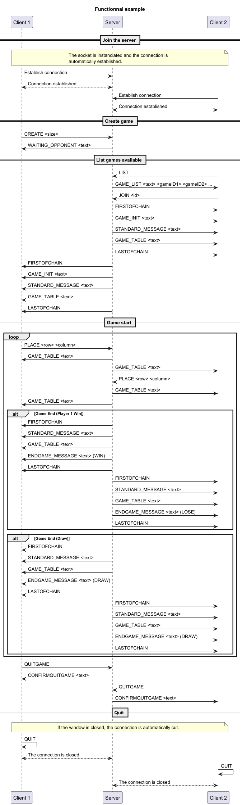

# Application protocol

## Table of content
   -[Section 1 - Overview](#section-1---overview)  
   -[Section 2 - Transport protocol](#section-2---transport-protocol)  
   -[Section 3 - Messages](#section-3---messages)  
   -[Section 4 - Examples](#section-4---examples)

## Section 1 - Overview

The "Tic Tac Toe" protocol is a communication protocol that allows clients to play tic tac toe on a server together.

## Section 2 - Transport protocol

The "Tic Tac Toe" protocol is a text transport protocol. It uses the TCP transport protocol to ensure the reliability of data transmission. The port it uses is the port number 6433.  

Every message must be encoded in UTF-8. The messages are treated as text messages.

The initial connection must be established by one of the clients, he is attributed Player 1.

Once the connection is estalibshed, the player 1 choose the size of the board(min 3 and max 9).
The board is generated.

Another client can connect to the same server and will be attributed Player 2.

A loop will initiate, where:
- A player will make a move 
- His board is updated
- The other player will be notified of the move
- The other player's board is updated

A move is communicated using X, the column, and Y, the line, with the format `XY`.

Another format will send back an error.

An error can also be sent, if a player tries to put his symbol in a space that is already occupied.

After a minimum number of moves depending on the size of the board, the appilcation will begin to check for a win.
If the number of moves maximum is reached, the game will be determined to be a draw.

After a game has finished, the Player 1 can choose to begin another game, where they can put the same size of board or change it, or exit.

> [!NOTE]  
> 
> The network connection can be closed on both sides (client and server). In the SMS protocol, the client closes the connection. In this example, we have decided that the client will advise the server to close the connection. The server will then close the connection on its side. This will close the connection on the client side as well.
> Both solutions are possible.


## Section 3 - Messages

### Join the server

The client send a message to the server and the name of the player is assigned automatically based on their order of arrival.

#### Request
```sh
JOIN
```

#### Response

- OK: the client has been granted access to the server
- ``ERROR <code>``: an error occured. The error code is between 1 and 1 inclusive. The error codes are as follow:
    - 1: the game is already full

### List started games

The client sends a message to the server to request the list game waiting for another player.

#### Request

````sh
LIST
````

#### Response

- ``Games...``

### Create board

The client sends a message to the server to create a new board.

#### Request

````sh
CREATE BOARD <size>
````
- ``size``: the size of the board

#### Response
waiting screen

### Send a move

The client send a move to the server.

#### Request

````sh
XY
````
- ``X``: column of the board
- ``Y``: line of the board

#### Response
- ``OK``:The server actualize the board for the player
- ``ERROR <code>``: an error occured. The error code is between 1 and 3 inclusive. The error codes are as follow:
  - 1: the format of the selection is wrong
  - 2: the case selected has already been filed
  - 3: the case selected is out of bounds

### Recieve a move

The server send the move of the opposing player.

#### Response

The board is updtaed with the opposing player's move.

## Section 4 - Examples

### Functional Example

### A Player try to join a game that is already full

### The size for the board is out of bounds

### Wrong Format grid selection error

### Case already filed error

### Out of bound grid selection error
